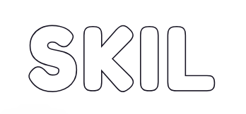
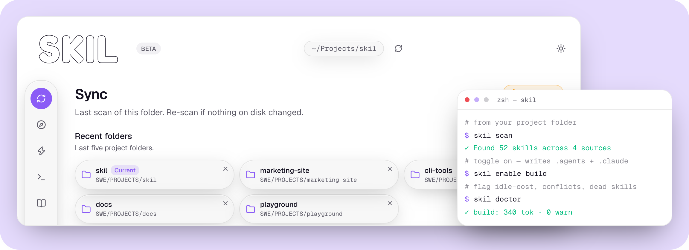

<div align="center">

[](https://github.com/eric-huychung/skil/actions/workflows/ci.yml)
[](LICENSE)


<br>

<p align="center">
  <picture>
    <source media="(prefers-color-scheme: dark)" srcset="docs/assets/wordmark-dark.png">
    
  </picture>
</p>

Find skills, organize them, and kill the dead ones.

<br>

<a href="https://www.skil.website/"> Website</a>
&nbsp;&nbsp;·&nbsp;&nbsp;
<a href="https://github.com/eric-huychung/skil/releases/latest"> Download</a>
&nbsp;&nbsp;·&nbsp;&nbsp;
<a href="https://github.com/eric-huychung/skil"> Source</a>

<br>
<br>

<p align="center">
  <picture>
    <source media="(prefers-color-scheme: dark)" srcset="docs/assets/hero-dark.png">
    
  </picture>
</p>

<br>
<br>

</div>

|  <br>**Find** | <br>**Organize** | <br>**Eval** |
| :---: | :---: | :---: |
| Search the market, get picks for your repo, install in one command | Turn skills, commands and rules on or off. Off means parked, never deleted | Spot idle, bloated or unused skills before they cost you context |

##  Install

###  App

Download the `.dmg` from [skil.website](https://www.skil.website/) or [Releases](https://github.com/eric-huychung/skil/releases/latest).

Or run these two lines. `curl` skips the browser quarantine stamp, so macOS won't block it:

```bash
curl -L -o ~/Downloads/skil.dmg \
  https://github.com/eric-huychung/skil/releases/latest/download/Skil-arm64.dmg
open ~/Downloads/skil.dmg
```

Drag **Skil** into Applications, then run:

```bash
xattr -cr /Applications/Skil.app
```

> **Intel Mac?** Use `Skil-x64.dmg` instead of `Skil-arm64.dmg`.
>
> **Opened it by double-click?** The app is unsigned (no Apple fee), so macOS may block it once. Go to **System Settings → Privacy & Security → Open Anyway**.

###  CLI

Needs Node 20 or newer.

```bash
git clone https://github.com/eric-huychung/skil.git
cd skil && npm install && npm run build && npm link
```

Then, from any project folder:

```bash
skil --help
```

##  Commands

Run these from your project folder.

###  Find

| Command | What it does |
| :-- | :-- |
| `skil search` | Top 10 skills by installs |
| `skil search --trending` | What's hot right now |
| `skil search react` | Look up a skill by name |
| `skil suggest` | Picks for this repo. Doesn't install |
| `skil install obra/react-patterns` | Add a skill to the project. Use the name from the left column of `search` |

###  Organize

**On** is a copy in both `.agents/skills` and `.claude/skills`. **Off** is parked under `.skil/parked`, not deleted. The map lives in `.skil/state.json`.

**Skills**

| Command | What it does |
| :-- | :-- |
| `skil scan` | Find `SKILL.md` folders and copy leftover-only skills, commands and rules into the live pair |
| `skil skills` | List the catalog, on or off |
| `skil skills enable tdd` | Turn a skill on |
| `skil skills disable tdd` | Park a skill |

**Commands** are workflows (`build` becomes `/build`). Adding a skill to one doesn't turn that skill on.

| Command | What it does |
| :-- | :-- |
| `skil create build --skills tdd` | Make a command. Starts off |
| `skil list` | Show what's on the map |
| `skil add build design` | Put a skill on a command |
| `skil remove build design` | Take it off |
| `skil enable build` | Turn the command on |
| `skil disable build` | Park the command |
| `skil delete build` | Drop the command |

**Rules**

| Command | What it does |
| :-- | :-- |
| `skil rules` | List shared `AGENTS.md` sections and other rule files |
| `skil rules enable pair-programming/behavior` | Turn a shared section on |
| `skil rules disable pair-programming/behavior` | Turn it off |

###  Eval

| Command | What it does |
| :-- | :-- |
| `skil doctor` | Checkup for every command |
| `skil doctor build` | Findings for one command |
| `skil usage` | How often Claude actually read each skill |

##  Run the app from source

Same project, visual. Discover, Skills, Commands, Rules, Sync, Settings.

```bash
npm run gui:dev
```

---

MIT · Built by [Eric Chung](https://www.linkedin.com/in/huychung/)
