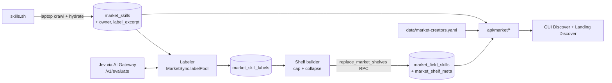

# Skill discovery expansion: system design

Status: design, 2026-10-04. Builds on `reports/Skill discovery expansion.md` (the spec), which has the data, the decisions and the Jev test call. This file says **how** to build it: modules, data model, seams, failure paths and the task list. No product code yet.

Decisions added in this round (2026-10-04, with the product owner):

- The SKILL.md excerpt that Jev reads is **stored in Supabase**, so the weekly GitHub job can relabel without calling skills.sh.
- The **existing weekly GitHub workflow** (`.github/workflows/sync-market.yml`) is updated. No new cron. It stays label-only; crawling skills.sh stays a laptop job.
- Creators ships on **both** the GUI Discover and the landing page Discover.

---

## 1. Where things are today

```
laptop: npm run sync-market                 GitHub Actions, Sunday 00:00 UTC
  seed → crawl listing (OIDC) → hydrate       npm run sync-market -- --classify-only
  → classify top 1000 → write shelves          seed → classify top 1000 → write shelves
                     \                          /
                      v                        v
            Supabase: market_roles, market_fields, market_skills, market_field_skills
                                  |
              api/market/{shelves,search,preview,suggested}.ts  (Vercel functions, CDN 1h)
                                  |
             +--------------------+---------------------+
             |                                          |
  src/backend/discover.ts (axios, main process)   web/lib/market-api.ts (same-origin fetch)
  gui MarketDiscover.tsx via IPC bridge           web/components/landing/discover.tsx
  CLI skil search / suggest / install
```

Existing modules this design builds on:

| Module | Role today | Change |
|---|---|---|
| `src/backend/market-store.ts` (+ `in-memory-…`, `supabase-…`) | Persistence seam for the market index | New methods for owners, labels, excerpt, atomic shelves |
| `src/backend/market-sync.ts` | Crawl, hydrate, `refreshActiveFields` (top 1000 → classify → shelves) | Split into `labelPool` (incremental, Jev) and `rebuildShelves` (from stored labels) |
| `src/backend/skill-classifier.ts` | `SkillClassifier` seam, returns 0–2 slugs | Returns per-field probabilities |
| `src/backend/llm-skill-classifier.ts` | `gpt-4o-mini` via gateway chat | Kept for the gold baseline, then deleted |
| `src/backend/shelf-assembler.ts` | `dedupByName`, `buildShelves` (unlabeled → `integrations`) | Threshold, max 3, owner cap, suite collapse, no dumping |
| `src/backend/market-skills-client.ts` | skills.sh HTTP; `getSkill` already downloads `files[].contents` | Also returns the body excerpt (no extra request) |
| `src/backend/market-read.ts` | Request → Response handlers | New `handleCreatorsRequest`; shelves gets `meta.generatedAt` |
| `src/backend/market-picks.ts` + `data/market-picks.yaml` | YAML editorial picks pattern | Copied for `data/market-creators.yaml` |
| `src/backend/discover.ts` | One Discover seam for CLI + GUI | `creators()`, `creator(slug)` |
| `scripts/sync-market.ts` | Operator script, throws on error | Run summary, exit codes, new flags |
| `.github/workflows/sync-market.yml` | Weekly `--classify-only`, no alerts | Same job, labels incrementally, Slack on failure, stale check |

Facts that matter for the design (checked in code):

- `getSkill` already fetches the full `SKILL.md` text (`files[].contents`) and throws it away after parsing the description. **The excerpt costs no extra request.** That settles the spec's "Unverified: confirm `getSkill` returns the body text."
- The weekly job can't call skills.sh: it has no Vercel OIDC token. Anything Jev needs must already be in Supabase. That's why the excerpt is stored.
- **Supabase/PostgREST returns at most 1,000 rows per request by default.** The full pool (9.7k rows) and the 30 creators' skills (about 1,040 rows) both go over that. Every "all rows" read must page with `.range()` or aggregate in SQL. Today's `listTopListings(1000)` only works because it stops at exactly 1,000.
- `setFieldShelf` deletes and then inserts, one field at a time. A failure halfway leaves a partial shelf. supabase-js has no client transactions, so making the swap atomic needs a Postgres function (RPC).
- The landing site is a static export (`output: 'export'`). A creator detail **route** would need `generateStaticParams`. The design uses in-page view state instead, the same way the preview dialog works.

---

## 2. Target architecture



There are four separate flows. Each has its own failure scope:

1. **Crawl** (laptop, needs OIDC): listing → `market_skills`; hydrate → `description`, `hash`, **`label_excerpt`**. Unchanged, except hydrate also writes the excerpt.
2. **Label + shelves** (weekly GitHub job, and laptop): load the pool → work out what changed → ask Jev → save labels batch by batch → rebuild every shelf in one transaction, only when every row is covered.
3. **Creators report** (laptop only, read-only for users): rank owners → Jev tech gate (cached) → skills.sh `/official` → GitHub followers → print a proposal. A human edits the YAML.
4. **Read** (Vercel functions): shelves, search, preview, suggested, and the new **creators**.

---

## 3. Data model

Three additive migrations. All are idempotent (`if not exists`, `on conflict do nothing`, `create or replace`), the same style as 0001–0005. Nothing is dropped or renamed.

### 0006_market_owner.sql (Creators)

```sql
alter table public.market_skills
  add column if not exists owner text generated always as (split_part(source, '/', 1)) stored;
create index if not exists market_skills_owner_idx on public.market_skills (owner) where inactive = false;
create index if not exists market_skills_active_installs_idx
  on public.market_skills (installs desc) where inactive = false;

-- One row per owner: ranking (best_installs) and card numbers, without pulling 9.7k rows.
create or replace view public.market_owner_stats as
  select owner,
         count(*)::int       as skill_count,
         sum(installs)::bigint as total_installs,
         max(installs)::bigint as best_installs
  from public.market_skills
  where inactive = false
  group by owner;
```

`market_owner_stats` avoids the 1,000-row cap for the list endpoint and the report. It's a plain view (about 10k rows to group, so milliseconds), not materialized.

### 0007_market_labels.sql (topics, safety net)

```sql
-- Excerpt Jev reads. Capped at 1,000 chars by the parser, like `description` is capped at 500.
alter table public.market_skills add column if not exists label_excerpt text;

-- One row per skill per taxonomy version. All field probabilities kept.
create table if not exists public.market_skill_labels (
  skill_id         text not null references public.market_skills (id) on delete cascade,
  taxonomy_version text not null,     -- hash of the question set (see §5.2)
  state_hash       text not null,     -- sha256 of the exact text sent to Jev
  model_version    text not null,     -- e.g. "typesafe-ai/jev@1.13.0" from the response
  probabilities    jsonb not null,    -- { "frontend": 0.91, "testing": 0.04, ... } all fields
  status           text not null check (status in ('ok', 'error')),
  labeled_at       timestamptz not null default now(),
  primary key (skill_id, taxonomy_version)
);
create index if not exists market_skill_labels_version_idx on public.market_skill_labels (taxonomy_version);

-- Tech-gate cache for the creators report. One row per owner group.
create table if not exists public.market_creator_checks (
  creator_key      text primary key,  -- sorted owner aliases joined by '+', e.g. "larksuite+open.feishu.cn"
  state_hash       text not null,
  tech_probability real not null,
  domain           text not null,
  model_version    text not null,
  checked_at       timestamptz not null default now()
);

-- When shelves were last built, and from which labels.
create table if not exists public.market_shelf_meta (
  id               boolean primary key default true check (id),   -- single row
  generated_at     timestamptz not null,
  taxonomy_version text not null
);

-- Collapsed vendor suite: lead row plus "+N more".
alter table public.market_field_skills add column if not exists more_count integer not null default 0;

-- Replace every shelf in one transaction. payload: [{ field_slug, skills: [{ id, more_count }] }]
create or replace function public.replace_market_shelves(payload jsonb, taxonomy text)
returns void language plpgsql security definer set search_path = public as $$
begin
  delete from market_field_skills;
  insert into market_field_skills (field_slug, skill_id, rank, more_count)
  select f->>'field_slug', s.value->>'id', s.ordinality::int, coalesce((s.value->>'more_count')::int, 0)
  from jsonb_array_elements(payload) f,
       jsonb_array_elements(f->'skills') with ordinality s;
  insert into market_shelf_meta (id, generated_at, taxonomy_version) values (true, now(), taxonomy)
  on conflict (id) do update set generated_at = excluded.generated_at, taxonomy_version = excluded.taxonomy_version;
end $$;
revoke all on function public.replace_market_shelves(jsonb, text) from public, anon, authenticated;
```

RLS: enable it on the three new tables and add **no** anon/authenticated policies. Only the service role (sync and API) reads or writes them. The functions already use the service role, so nothing public changes.

Why the labels table differs from the spec's `(skill_id, field_slug, probability, …)`:

| Choice | Why |
|---|---|
| One row per skill, all probabilities in `jsonb` | A "no label" result is just a row whose probabilities all fall below the threshold. The spec needs an explicit "none" and per-field rows can't express it. Keeping every probability also means **threshold tuning needs no new model calls**. 9.7k rows of about 400 bytes is tiny. |
| Keyed by `state_hash`, not `content_hash` | Relabels whenever **anything Jev sees** changes: description, excerpt backfill, name. Using `content_hash` alone would miss the excerpt backfill. |
| `status = 'error'` rows | A skill that fails twice is recorded and covered (no shelf placement) and retried next run. A few bad rows can't block shelves forever. |
| PK `(skill_id, taxonomy_version)` | Old versions stay, so rollback = revert the question file → same version hash → old labels reused with zero calls. |

Is storing the excerpt efficient? Yes: at most 1,000 chars × 9.7k rows ≈ 10 MB, below Postgres's 2 KB TOAST threshold per row, and never sent to clients. Every existing read selects named columns, so shelves, search and preview don't pay for it. A separate 1:1 table would add a join to the one query that needs it, with no benefit at this size.

### 0008_market_search.sql (search, later phase)

```sql
create extension if not exists pg_trgm;
create index if not exists market_skills_name_trgm_idx on public.market_skills using gin (name gin_trgm_ops);

create or replace function public.search_market_skills(q text, lim int)
returns table (id text, name text, installs bigint) language sql stable as $$
  select id, name, installs
  from market_skills, websearch_to_tsquery('english', q) query
  where inactive = false and (search_vector @@ query or name % q or owner = lower(q))
  order by ts_rank_cd(search_vector, query) + similarity(name, q) + 0.05 * ln(greatest(installs, 1)) desc
  limit lim;
$$;
```

The exact weights are tuned by query tests (task 22), not fixed here.

### `data/market-creators.yaml` (new, ships with the repo)

```yaml
# Creators shelf. Order = display order. Run the creators tests after edits.
# Proposals come from: npm run sync-market -- --creators-report
updatedAt: 2026-10-04
techCutoff: 0.4                 # used by the report only
officialFetchedAt: 2026-10-04   # snapshot of https://skills.sh/official
officialOwners: [anthropics, vercel-labs, microsoft, remotion-dev, supabase, prisma, firebase, neondatabase, google, better-auth, ...]
blocked: []
creators:
  - { slug: addyosmani, label: Addy Osmani, owners: [addyosmani], pinned: true }
  - { slug: antfu,      label: Anthony Fu,  owners: [antfu],      pinned: true }
  - { slug: vercel-labs, label: Vercel Labs, owners: [vercel-labs] }
  - { slug: google,      label: Google,      owners: [google, googleworkspace, google-labs-code] }
  # ... 30 entries total
```

- No Org/Person badge (dropped 2026-10-04), so no GitHub data is stored in the YAML. Followers stay in the report only.
- `tech: true|false` is an optional per-creator override, used only by the report.
- **Validation** (parser throws, a test enforces it): exactly 30 entries; all `pinned` entries come first; slugs unique; every owner belongs to at most one creator; no owner is in `blocked`; `officialOwners` is non-empty.

---

## 4. Module design (deep modules, small interfaces)

### 4.1 `JevClient`: one call, typed answers, classified errors

`src/backend/jev-client.ts`. It's the only code that knows the gateway's wire shape.

```ts
export type JevQuestion =
  | { kind: 'boolean'; prompt: string }
  | { kind: 'choice'; prompt: string; options: Record<string, string> };

export type JevAnswer =
  | { kind: 'boolean'; probability: number }
  | { kind: 'choice'; option: string; probabilities: Record<string, number> };

export type JevErrorKind = 'auth' | 'request' | 'unavailable' | 'bad_answer';
export class JevError extends Error { constructor(readonly kind: JevErrorKind, message: string, readonly status?: number) }

export interface JevClient {
  evaluate(state: string, questions: Record<string, JevQuestion>):
    Promise<Result<{ answers: Record<string, JevAnswer>; modelVersion: string; inputTokens: number }>>;
}

export class GatewayJevClient implements JevClient {
  constructor(deps: { fetchImpl: typeof fetch; apiKey: string; sleep?: (ms: number) => Promise<void>; random?: () => number })
}
```

Inside it:
- `POST https://ai-gateway.vercel.sh/v1/evaluate`, body `{ model: 'typesafe-ai/jev', state, questions }`, mapped from `JevQuestion` to the gateway's `boolean`/`choice` shape. No `fallbacks` option, by decision.
- Retries: 429, 529, other 5xx, network errors and timeouts (15 s, `AbortSignal.timeout`). Exponential backoff with full jitter, base 500 ms, cap 20 s, **5 tries**. `sleep` and `random` are injected so tests don't wait.
- No retry on 401 (`auth`) or 422 (`request`). The error message carries the status and a short body excerpt, **never the key**.
- Response validation: every asked question present, probabilities in [0, 1], choice option in the given set. Any miss → `JevError('bad_answer')`. The caller decides whether to retry.

Test seam: injected `fetchImpl`. A **contract test** replays a recorded response from the 2026-10-04 test call (`src/backend/__fixtures__/jev-evaluate-response.json`) so a change in the gateway format shows up. ⚠ That recording isn't in the repo yet. Task 11 captures one real response (about $0.00004) and commits it with no secrets.

### 4.2 Taxonomy: questions as data, version computed from them

`src/backend/topic-taxonomy.ts`.

```ts
export interface TopicQuestion { fieldSlug: string; prompt: string }
export const TOPIC_QUESTIONS: TopicQuestion[];         // one per active field, reworded `workflow` and `integrations`
export const TAXONOMY_VERSION: string;                  // sha256(JSON of TOPIC_QUESTIONS).slice(0, 12)
export const TOPIC_THRESHOLD = 0.6;                     // starting value, tuned on the gold set
export const MAX_TOPICS_PER_SKILL = 3;
export const REVIEW_BAND = { low: 0.4, high: 0.6 };
```

- **Nobody hand-bumps `taxonomy_version`.** It's the hash of the question set, so changing a question or adding a field relabels automatically, and reverting a change brings the old labels back.
- The threshold is **not** part of the version, because all probabilities are stored. Changing it only rebuilds shelves.
- A test checks that every `TOPIC_QUESTIONS.fieldSlug` exists in `SEED_FIELDS`, and the other way round for active fields.

### 4.3 Label state: what Jev reads

`src/backend/label-state.ts`. Pure functions.

```ts
export interface LabelPoolRow { id: string; name: string; source: string; installs: number;
  description: string | null; labelExcerpt: string | null; owner: string }
export function buildLabelState(row: LabelPoolRow): string   // "name: …\nrepo: …\ndescription: …\nexcerpt: …"
export function stateHash(state: string): string             // sha256 hex
```

`parseSkillExcerpt(md: string): string | null` goes in `parse-skill-description.ts`: strip frontmatter, drop code fences and long tables, collapse whitespace, take the first 1,000 chars, cut at a word boundary.

### 4.4 `SkillClassifier` seam, updated

```ts
export interface SkillScore {
  id: string;
  status: 'ok' | 'error';
  probabilities: Record<string, number>;   // all fields when ok; {} when error
  stateHash: string;
  modelVersion: string;
}
export interface SkillClassifier {
  classify(rows: LabelPoolRow[], questions: TopicQuestion[]): Promise<Result<SkillScore[]>>;
}
```

- `JevSkillClassifier` (new) makes one Jev call per skill, with one boolean question per field, through a **bounded worker pool** (8 workers, paced to at most 600 requests/min, half the reported limit). On `bad_answer` it retries the skill once and then returns `status: 'error'`. On `auth`, `request` or `unavailable` (after retries) it returns `Err` for the whole call.
- `LlmSkillClassifier` (existing) adapts to the new seam by returning `1.0` for chosen slugs and `0` for the rest, so the **gold-set baseline runs through the same seam**. It's deleted after Jev matches or beats it.
- `FakeSkillClassifier` returns canned probabilities and can be scripted to fail chosen ids. Tests use it everywhere above this seam.
- Pure helper `topicsFor(probabilities, threshold, max): string[]`: fields ≥ threshold, highest first, at most 3.

### 4.5 `MarketSync`: labeling and shelves split

```ts
class MarketSync {
  // existing: crawlListing, hydrateDetails (now also writes label_excerpt), syncListing
  labelPool(opts: { dryRun?: boolean; batchSize?: number }): Promise<Result<LabelRunResult>>;
  rebuildShelves(opts: { dryRun?: boolean }): Promise<Result<ShelfRunResult>>;
  refreshActiveFields(): Promise<Result<…>>;   // kept until task 20 switches the job, then deleted
}

interface LabelRunResult { needed: number; labeled: number; errored: number; skippedUnchanged: number; batches: number }
interface ShelfRunResult { written: boolean; reason?: 'incomplete_coverage'; fields: Array<{ slug: string; count: number; distinctOwners: number }> }
```

`labelPool`:
1. `store.listLabelPool()` pages all active rows (`.range()` in 1,000s).
2. `store.listLabelKeys(TAXONOMY_VERSION)` returns `skill_id → { stateHash, status }`.
3. **Needs a label** when there's no row, the stored `state_hash` differs, or `status = 'error'`.
4. Batches of 100 → `classifier.classify` → `store.saveLabels(version, scores)` (one upsert per batch). A failed batch returns `Err`, and earlier batches stay saved. The next run skips them because their `state_hash` matches, so **resume is free**.
5. After each batch, count errored rows. If errored/needed passes 2% → `Err(bad_answers)`.
6. `dryRun` does everything except `saveLabels` and prints the diff against stored labels.

`rebuildShelves`:
1. **Coverage gate:** every active row has a label row for this version with a matching `state_hash` (ok or error). If not, return `{ written: false, reason: 'incomplete_coverage' }`. The script treats this as a failure.
2. Load fields and labels (paged), then `buildShelves` (§4.6).
3. `store.replaceShelves(shelves, TAXONOMY_VERSION)` → RPC → all shelves plus `generated_at` in one transaction.

### 4.6 `buildShelves`: model-free shelf hygiene

`src/backend/shelf-assembler.ts`. Still a pure function, with more rules:

```ts
export interface ShelfInputRow { id: string; name: string; source: string; owner: string; installs: number;
  probabilities: Record<string, number> }
export interface ShelfEntry { id: string; moreCount: number }
export interface AssembledShelf { fieldSlug: string; entries: ShelfEntry[] }
export function buildShelves(input: { rows: ShelfInputRow[]; fields: MarketField[];
  threshold: number; maxTopics: number; ownerCap: number }): AssembledShelf[]
```

Order of operations, per field:
1. **Assign topics** with `topicsFor`. A skill with no topic goes nowhere. **No more `integrations` dumping.**
2. **Dedup by name** for display only, highest installs wins. This stays out of labeling and out of Creators.
3. **Suite collapse.** Group rows with the same `source` (owner/repo) and the same name prefix before the first `-`, when the group has **3 or more** rows. The best-installed row leads, and `moreCount` = group size − 1.
4. **Rank** by confidence tier (probability ≥ 0.8 is tier 0, else tier 1), then installs descending.
5. **Owner cap**: at most 5 entries per owner per shelf. A collapsed suite counts as one entry.
6. Cut to `shelfSize`.

Shelf-health numbers come from the same pass: distinct skills per slot, and the top owner's share per shelf. They're printed by the script.

### 4.7 Creators

```
src/backend/market-creators.ts     parseMarketCreators / loadMarketCreators (validation, like market-picks.ts)
src/backend/creator-ranking.ts     pure: mergeAliases, rankCandidates(best_installs), selectThirty(pins first, gate, blocked)
src/backend/creator-gate.ts        buildCreatorState, gateCreators(owners, jev, cache) → { techProbability, domain }
src/backend/official-owners.ts     parseOfficialOwners(html): string[]  (pure) + fetchOfficialOwners(fetchImpl)
src/backend/creators-report.ts     runCreatorsReport(deps) → ReportModel; formatReport(model) → string
```

**Read path** (the users' critical path; it never calls Jev, GitHub or the `/official` page):

```ts
// MarketStore additions
listOwnerStats(owners: string[]): Promise<Result<OwnerStats[]>>;                 // from market_owner_stats
listSkillsByOwners(owners: string[], taxonomyVersion: string): Promise<Result<CreatorSkillRow[]>>; // paged; topics joined
```

`GET /api/market/creators` → 30 cards in YAML order:
```json
{ "data": [ { "slug": "vercel-labs", "label": "Vercel Labs", "official": true, "pinned": false,
              "skillCount": 41, "totalInstalls": 9123456 } ],
  "meta": { "updatedAt": "2026-10-04", "installsSource": "skills.sh" } }
```
`GET /api/market/creators?slug=vercel-labs` → one creator plus their skills grouped by repo:
```json
{ "data": { "slug": "...", "label": "...", "official": true,
            "repos": [ { "source": "vercel-labs/agent-skills", "skills": [ { "id": "...", "name": "...", "installs": 1, "topics": ["frontend"] } ] } ] } }
```
- One function file (`api/market/creators.ts`) with an optional `?slug=`, the same query-param style as `preview?id=`, and one `vercel.json` entry with `includeFiles: "{dist/**,data/market-creators.yaml}"`. (The spec wrote `/creators/:slug`. A query param matches the existing endpoints and needs no dynamic route.)
- Unknown slug → 404. Bad YAML → 500 `config_error`. Store error → 500 `store_error`. CDN `s-maxage=3600, stale-while-revalidate=1800`, same as shelves.
- `official` = any of the creator's owners is in `officialOwners`.
- `topics` are field slugs that pass the threshold for the current `TAXONOMY_VERSION`. The response is `[]` until labels exist, so Creators can ship before topics.
- **Not deduped by name.**

**Report path** (laptop: `npm run sync-market -- --creators-report`, read-only for users):
1. `market_owner_stats` ordered by `best_installs`, top 100, aliases merged.
2. For each candidate: state = owner name + top 10 skills (name + description). Look up `market_creator_checks` by `creator_key` + `state_hash`, and call Jev only on a miss (boolean "tech related" + choice "domain"). Save to cache.
3. Apply `tech:` overrides, then `blocked`, then the cutoff from YAML.
4. `selectThirty`: pins first, then gate passers by `best_installs`, 30 total.
5. Fetch `https://skills.sh/official` and parse owner links. On failure: show "official list unchanged (fetch failed: …)" and keep going.
6. GitHub `GET /users/{owner}` for followers (information only, to spot small accounts). Uses `GITHUB_TOKEN` if set. Without it, the column shows "n/a" (the unauthenticated limit is 60/hour).
7. Print: the proposed 30 with score, tech probability, domain, followers, official, and **enter/leave against the current YAML**, then a paste-ready YAML block for `creators` and `officialOwners`. It writes nothing to the YAML. (The spec also had the script writing `officialOwners`. Printing a paste-ready block keeps "a human edits the YAML" true, and js-yaml would drop the file's comments on rewrite.)

### 4.8 Clients: one seam for GUI and CLI, one thin client for the web

- `src/backend/discover.ts`: add `creators(): Result<CreatorCard[]>` and `creator(slug): Result<CreatorDetail>`. Types live in `market-types.ts`.
- GUI: new IPC channels `marketCreators` and `marketCreator` in `gui/src/shared/ipc.ts`, wired in `gui/src/main/index.ts` and the preload, the same as `marketShelves`.
- Web: `fetchCreators()` and `fetchCreator(slug)` in `web/lib/market-api.ts`, with local mirror types (the web build doesn't import `src/`).

### 4.9 UI (GUI and landing, same behavior)

- New pseudo-tab **Creators**, next to Top and Trending, before the role tabs. Category chips are hidden while it's active, the same rule as Top/Trending.
- **Grid**: card = label, optional **"Official on skills.sh"** badge, skill count, total installs, and the source note "installs, skills.sh". Pins have no special marker. The word "verified" never appears.
- **Detail** (in-page state, no route): back button, header, then skills grouped by repo. Each row: name, installs, topic chips (field labels from the shelves payload; nothing shown when empty), and click → existing preview. GUI gets the existing `+` install. Landing gets the existing copy `npx skills add`.
- Shelf rows with `moreCount > 0` show "name, +N more". Clicking "+N more" runs a search for the suite prefix in the same view.
- Loading, empty and error states reuse `StatusNotice`/`StatusSkeleton` (GUI) and the existing landing patterns. A failed creators fetch shows a retry and doesn't break the other tabs.

---

## 5. The weekly job, updated

### 5.1 `scripts/sync-market.ts` flags

| Flag | Does | Where |
|---|---|---|
| *(none)* | seed → crawl → hydrate (+excerpt) → label → shelves | laptop (OIDC) |
| `--classify-only` | seed → label (incremental) → shelves. Flag name kept so the workflow and docs don't churn. | **weekly GitHub job**, laptop |
| `--dry-run` | with the above: no label or shelf writes; prints label diff and shelf-health numbers | laptop |
| `--backfill-excerpt` | hydrate rows where `label_excerpt is null`, paced like hydrate (8/s, about 20 min for 9.7k) | laptop, once |
| `--creators-report` | §4.7 report, no writes except the gate cache | laptop |
| `--max-detail=N` | existing | laptop |

Hydrate change: `hydrateOne` treats a row as unchanged only when the hash matches **and** `label_excerpt` is present. So the backfill and normal hydrate are the same code path.

### 5.2 Run summary and exit codes

The script builds a `SyncRunSummary` and writes it to `.sync-market/summary.json`, plus a Markdown copy to `$GITHUB_STEP_SUMMARY` when that variable is set:

```ts
interface SyncRunSummary {
  status: 'ok' | 'failed';
  failedStep?: 'config' | 'seed' | 'crawl' | 'hydrate' | 'label' | 'shelves';
  failureKind?: 'config' | 'auth' | 'request' | 'unavailable' | 'bad_answers' | 'incomplete_coverage' | 'store';
  firstError?: string;               // status + short message, secrets redacted
  labeled: number; needed: number; errored: number;
  shelvesWritten: boolean;
  shelvesGeneratedAt: string | null; // from market_shelf_meta, read at the end
  taxonomyVersion: string; modelCalls: number; inputTokens: number;
}
```

Exit code: `0` if `status === 'ok'`, else `1`. `main()` stops throwing raw errors. Each step returns `Result`, and one `summarize()` maps it to the summary. The mapping is a pure function and gets unit tests. Laptop and CI behave the same (spec requirement).

### 5.3 `.github/workflows/sync-market.yml`

```yaml
jobs:
  sync:
    runs-on: ubuntu-latest
    timeout-minutes: 45          # first full label run is ~10–20 min; weekly delta is ~1 min
    steps:
      - uses: actions/checkout@v5
      - uses: actions/setup-node@v6
        with: { node-version: 22, cache: npm }
      - run: npm ci
      - name: Label skills and rebuild shelves
        env: { NEXT_PUBLIC_SUPABASE_URL: …, SUPABASE_SERVICE_ROLE_KEY: …, AI_GATEWAY_API_KEY: … }
        run: npm run sync-market -- --classify-only
      - name: Alert Slack on failure
        if: failure()
        env:
          SLACK_WEBHOOK_URL: ${{ secrets.SLACK_WEBHOOK_URL }}
          RUN_URL: ${{ github.server_url }}/${{ github.repository }}/actions/runs/${{ github.run_id }}
        run: npx tsx scripts/notify-slack.ts failure
      - name: Warn if shelves are stale
        if: always()
        env: { SLACK_WEBHOOK_URL: …, RUN_URL: … }
        run: npx tsx scripts/notify-slack.ts stale --max-age-days=10
```

`scripts/notify-slack.ts` reads `.sync-market/summary.json`. The message text comes from a pure `formatSlackMessage(summary, runUrl, kind)` with tests: run URL, failed step, labeled vs. needed, first error, shelf age. If `SLACK_WEBHOOK_URL` is empty it logs "Slack not configured" and exits 0, because the secret gets set later by decision. If the summary file is missing (the job died before writing it), it posts "sync-market failed before writing a summary" plus the run URL.

**What the stale check can and can't catch.** It catches failed runs that still let the job reach the step. It **can't** catch a job that never runs. GitHub disables scheduled workflows after 60 days with no repo activity, and the job's own steps are what would send the alert. Mitigations: GitHub emails the repo owner when it disables a workflow, and both UIs can show "Shelves updated N days ago" from `meta.generatedAt` (optional, task 8/9 polish).

### 5.4 Failure matrix (behavior across modules)

| Failure | Where handled | Labels | Shelves | Exit / alert |
|---|---|---|---|---|
| Missing env | script | none | untouched | 1, `config` |
| 401 | `JevClient` (no retry) | earlier batches kept | untouched | 1, `auth` |
| 422 | `JevClient` (no retry), first payload logged without state text or key | earlier batches kept | untouched | 1, `request` |
| 429/529/5xx/network/timeout | `JevClient` 5 tries with jitter | earlier batches kept | untouched if still failing | 1, `unavailable` |
| Bad answer for one skill | classifier retries once → `status: 'error'` row | saved | rebuilt if ≤ 2% | 0 |
| Bad answers > 2% | `labelPool` | earlier batches kept | untouched | 1, `bad_answers` |
| Supabase error | store `Result` | earlier batches kept | untouched (RPC is atomic) | 1, `store` |
| Coverage incomplete | `rebuildShelves` | n/a | untouched | 1, `incomplete_coverage` |
| `/official` fetch fails | report only | n/a | n/a | report shows warning, exit 0 |

---

## 6. Test seams (agree these before writing tests)

| # | Seam | Test with | Covers |
|---|---|---|---|
| 1 | `JevClient` | injected `fetchImpl`, `sleep`, `random`; recorded fixture | request shape, 429/529 retry then success, 401/422 no retry, timeout, bad answer detection, key never in errors |
| 2 | `SkillClassifier` | `FakeSkillClassifier` (canned probabilities, scripted errors) | everything in `MarketSync.labelPool` |
| 3 | `MarketStore` | `InMemoryMarketStore` (gets every new method) | per-batch save, resume, zero calls on unchanged, coverage gate, atomic replace (an injected failure leaves old shelves) |
| 4 | Pure functions | plain unit tests | `buildShelves` (Azure/Lark fixtures, cap, collapse, no dumping, tiers), `topicsFor`, `buildLabelState`/`stateHash`, `parseSkillExcerpt`, `parseMarketCreators`, `selectThirty`, `mergeAliases`, `parseOfficialOwners` (saved HTML fixture), `summarize`, `formatSlackMessage` |
| 5 | Read handlers | `Request` → `Response` with in-memory store and a YAML path override | creators list/detail, 404, config error, cache headers, shelves `meta.generatedAt` |
| 6 | `Discover` | fake `get` | `creators()`, `creator(slug)` URLs and error mapping |
| 7 | UI | `MarketDiscover.test.tsx` with fake bridge; `web/lib/market-api.test.ts` | tab, grid, detail, badges, empty topics, `+N more` |
| 8 | Supabase adapter | not unit-tested (same as today); checked by a laptop `--dry-run` against real data | paging past 1,000 rows, RPC |
| — | Gold set | script `npm run eval-topics`, not CI | per-field precision/recall, unlabeled share; run before any model, question or threshold change ships |

Rule: no test touches the network. A real gateway call happens only in the one-time fixture capture and in laptop `--dry-run`.

---

## 7. Task list (vertical slices, small)

Each task: at most about 4 files plus their tests, one outcome. "Files" is a starting guess; check when building.

### Phase 0: Safety net (ships first; everything else depends on safe failure)

**T1. Correct the docs.** `docs/design/market-index.md` and the `scripts/sync-market.ts` header describe skills.sh only, 9.7k rows, no merged pool.
- Done when: no "20k", "SkillsMP", "AgenticSkills" or "merged" left in either file. The crawl-cap check (spec task 2) is noted in the design doc.

**T2. Run summary and exit codes.** `SyncRunSummary`, pure `summarize()`, summary file plus `$GITHUB_STEP_SUMMARY`. `main()` no longer throws.
- Done when: unit tests map each failure kind to the right summary. A missing env produces exit 1 and a summary file.
- Files: `scripts/sync-market.ts`, `src/backend/sync-summary.ts` (+test).

**T3. Slack and stale steps.** `scripts/notify-slack.ts` with pure `formatSlackMessage`, two workflow steps, timeout 45.
- Done when: tests cover failure, stale, missing summary and no-webhook. A manual `workflow_dispatch` with a bad key exits non-zero (Slack posts once the secret exists).
- Files: `scripts/notify-slack.ts` (+test), `.github/workflows/sync-market.yml`. Depends: T2.

**T4. Atomic shelf writes.** Migration 0007 (shelf part: `market_shelf_meta`, `more_count`, `replace_market_shelves`). `MarketStore.replaceShelves` replaces the per-field `setFieldShelf` loop. The shelves API adds `meta.generatedAt`.
- Done when: in-memory test: an injected failure mid-replace leaves the old shelves. The current classify path writes through `replaceShelves`.
- Files: migration, `market-store.ts`, both store adapters, `market-sync.ts`.
- Note: 0007 also holds the labels DDL (T15/T17). Either land all of 0007 here (it's additive and unused until later) or split it into 0007a/0007b. Recommendation: land it all in T4 so there's one migration to apply.

### Phase 1: Creators (largest visible win; needs no labels)

**T5. Owner column and stats.** Migration 0006. `listOwnerStats`, `listSkillsByOwners` (paged) in both stores.
- Done when: in-memory tests for alias-group stats and >1,000-row paging (the in-memory store simulates the page size).

**T6. Creators YAML.** `data/market-creators.yaml` (the launch 30 from the spec), `market-creators.ts` parser and validator.
- Done when: tests for exactly 30, pins first, unique owners, blocked excluded, `official` derived. The real file parses.

**T7. Creators read API.** `handleCreatorsRequest` (list and `?slug=`), `api/market/creators.ts`, `vercel.json` entry.
- Done when: handler tests (list order, detail grouped by repo, `topics: []` before labels, 404, 500s, cache header). Depends: T5, T6.

**T8. GUI Creators tab.** `Discover.creators/creator`, IPC and preload wiring, tab, grid, detail, badges, `+`.
- Done when: `MarketDiscover.test.tsx` covers tab → grid → detail → preview and an error with retry.
- If that goes over the file budget, split into T8a (seam + IPC) and T8b (UI).

**T9. Landing Creators tab.** `fetchCreators/fetchCreator`, Creators tab in `discover.tsx`, copy command in detail.
- Done when: `market-api.test.ts` covers both calls. Manual check in `npm run web:dev`. Depends: T7.

**T10. Creators report without the gate.** `creator-ranking.ts`, `official-owners.ts`, GitHub lookup, `formatReport`, `--creators-report`.
- Done when: pure tests for ranking, aliases, `selectThirty`, `/official` HTML parsing. A laptop run prints the table and the paste-ready YAML.

**T11. Jev client.** `GatewayJevClient`, `JevError`, captured fixture, contract test.
- Done when: seam 1 tests pass. The fixture is committed (one real call, no secrets).

**T12. Tech gate in the report.** `creator-gate.ts`, `market_creator_checks` read/write in both stores.
- Done when: a second run makes zero Jev calls for unchanged owners (fake client counts calls). The 0.4 cutoff and `tech:` overrides are applied. The laptop result matches the spec's list.

### Phase 2: Shelf hygiene (no model)

**T13. Owner cap and suite collapse.** `buildShelves` steps 3–5, `moreCount` written and read, `+N more` in both UIs.
- Done when: Azure and Lark fixtures show no owner over 5 and suites collapsed. Both UI tests render `+N more`.
- Watch for: this touches the assembler and two UIs. Split the UI part into T13b if it grows.

### Phase 3: Topics with Jev

**T14. Gold set and baseline.** About 200 labeled skills (`src/backend/topic-gold.json`, drafted by a general LLM, human reviewed), `scripts/eval-topics.ts`, a precision/recall report, a baseline run on `gpt-4o-mini` through the updated seam.
- Done when: baseline numbers are recorded in `docs/design/market-index.md`.

**T15. Excerpt capture and backfill.** `parseSkillExcerpt`, `getSkill` returns the excerpt, `setDetail` writes it, hydrate's unchanged rule, `--backfill-excerpt`.
- Done when: tests show a hash-equal row with no excerpt gets hydrated, and full bodies are never stored (the column is capped at 1,000). The backfill has been run once on a laptop.
- Order note: **run the backfill before T17's first full label run** so the first labels already include excerpts. `state_hash` would relabel later anyway, but that would pay twice.

**T16. Seam change and taxonomy.** `SkillScore` seam, `topic-taxonomy.ts` (questions with reworded `workflow`/`integrations`, computed version), `topicsFor`, `LlmSkillClassifier` adapter, `FakeSkillClassifier` update.
- Done when: existing classifier and assembler tests pass against the new seam. The field/question parity test passes.

**T17. `JevSkillClassifier` and incremental labeling.** Worker pool and pacing, retry-once on bad answers, `labelPool`, `listLabelPool`/`listLabelKeys`/`saveLabels` in both stores.
- Done when: seam 2 and 3 tests pass. A second run with no changes makes **zero** classifier calls. A failure in batch 3 keeps batches 1–2 and the next run resumes. More than 2% errors fails the run.

**T18. Shelves from stored labels.** `rebuildShelves` with the coverage gate, threshold, max 3, tiers, no `integrations` dumping. `--dry-run`. The script prints shelf-health numbers.
- Done when: tests cover coverage incomplete → shelves untouched, and no unlabeled skill on `integrations`. A laptop `--dry-run` on real data is reviewed against the gold set.

**T19. Creator topics live.** `listSkillsByOwners` joins current-version labels, so chips appear.
- Done when: a handler test shows topics for labeled rows and none for unlabeled rows.

**T20. Switch the weekly job and delete the old classifier.** The weekly job runs `labelPool` + `rebuildShelves`. Remove `refreshActiveFields`, `CLASSIFY_POOL_SIZE` and `llm-skill-classifier.ts` once the gold set shows Jev ≥ baseline.
- Done when: gold numbers are recorded and the first scheduled run is green with Slack quiet. Every active row has a label row.

### Phase 4: Search and taxonomy

**T21. Relevance-first search.** Migration 0008 (`pg_trgm`, `search_market_skills`), `searchListings` calls the RPC, the in-memory store mirrors the ordering rule.
- Done when: query tests for an exact name (`shadcn`), a typo (`tdd` / `tddd`) and a concept query.

**T22. Search by topic and owner.** The RPC also matches an owner name and current-version topic fields.
- Done when: a query for `vercel-labs` or `testing` returns those skills first.

**T23. Taxonomy review.** Look at unlabeled and review-band rows (0.4–0.6). Merge or add fields (media generation is a candidate). The version changes automatically.
- Done when: changes are logged in `decisions.md`, gold set not regressed.

**T24 (optional). pgvector.** Only if keyword search visibly misses things, or Doctor needs overlap detection.

### Order and checkpoints

```
T1 ─ T2 ─ T3                         Checkpoint A: failing run alerts, shelves untouched
      └─ T4
T5 ─ T6 ─ T7 ─ T8, T9                Checkpoint B: Creators live on GUI + landing
T10 ─ T11 ─ T12                      Checkpoint C: report reproduces the spec's list
T13                                  Checkpoint D: no owner > 5 per shelf
T14 ─ T15 ─ T16 ─ T17 ─ T18 ─ T19 ─ T20   Checkpoint E: every row labeled, gold ≥ baseline
T21 ─ T22 ─ T23                      Checkpoint F: search query tests green
```

Phases 1 and 2 can run in parallel with Phase 0 after T2, because they don't touch the job's failure path.

---

## 8. Rollout and rollback

1. Apply migrations 0006 and 0007 (additive) before deploying code that reads them.
2. Ship Phase 0, then trigger `workflow_dispatch` once with a deliberately bad key to watch the failure path. Restore the key.
3. Ship Creators (T5–T9) with the hand-checked launch list. Topic chips stay empty until T19.
4. Topics: baseline (T14) → backfill excerpts (T15) → `--dry-run` with Jev → review → real label run on a laptop (the long first run, about 10–20 min) → T20 switches the weekly job.
5. **Rollback:**
   - Bad shelves: revert the question/threshold change and re-run `--classify-only`. An old taxonomy version's labels are still stored, so the revert costs zero calls.
   - Bad Creators list: edit the YAML and deploy. The CDN updates within an hour.
   - Failed run: nothing to do. Shelves weren't touched.
   - The old classifier is deleted only after the gold set confirms Jev ≥ baseline (T20).

---

## 9. Where this design departs from the spec, and why

| Spec | This design | Reason |
|---|---|---|
| Labels: one row per (skill, field) | One row per (skill, taxonomy version), all probabilities in `jsonb`, plus a `status` | Explicit "none" and "error", free threshold retuning, one write per skill |
| Key on `content_hash` | Key on `state_hash` (what Jev actually saw) | Excerpt backfill and description changes relabel correctly |
| Hand-bumped `taxonomy_version` | Computed hash of the question set | Can't be forgotten; reverting restores old labels |
| Excerpt "not stored beyond what classification needs" | Stored, capped at 1,000 chars, in `label_excerpt` | The weekly job has no skills.sh access; agreed 2026-10-04 |
| `GET /api/market/creators/:slug` | `GET /api/market/creators?slug=` | Matches `preview?id=`; one function, one `vercel.json` entry |
| Org/Person badge on cards | Dropped | Product owner decision, 2026-10-04; keeps GitHub data out of the YAML and the read path |
| Report writes `officialOwners` into the YAML | Report prints a paste-ready block | Keeps the report read-only and the YAML comments intact |
| Creators tab in the GUI | GUI **and** landing | Agreed 2026-10-04 |
| Two new migrations | Three (0006 owner, 0007 labels/shelves, 0008 search) | Search ships last and needs an extension; easier to apply on its own |
| Stale-shelves warning | Kept, with its limit stated | It can't fire if the workflow itself is disabled |

## 10. Open items (none block Phase 0 or 1)

- **Jev fixture:** capture one real `/v1/evaluate` response for the contract test (T11). The gateway's exact field names for boolean prompts are confirmed only by that recording.
- **Crawl cap:** confirm the skills.sh listing ends naturally (spec task 2). Recorded in T1.
- **`GITHUB_TOKEN` for the report:** optional. Without it, followers and type show "n/a" past 60 lookups per hour.
- **Slack secret:** `SLACK_WEBHOOK_URL` is set later with the CLI. Until then the notify step logs and exits 0.
- **Crawl stays manual** (known gap, unchanged). New skills appear only after a laptop crawl.
